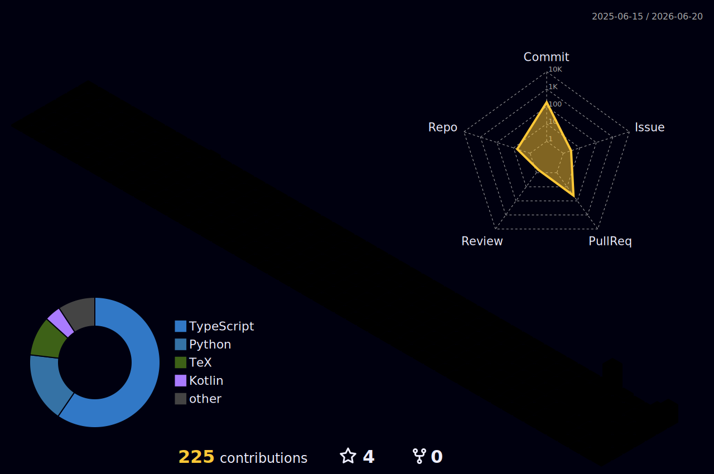

<div align="center">


<a href="https://github.com/Qrzzzz">
  
</a>

<p>
  
  
  
</p>

</div>

---

## 🧬 SYSTEM PROFILE

```txt
USER        Qrzzzz
MODE        Vibe Coding / Tool Building / AI-assisted Development
ROLE        IC Student · Builder · Automation Tinkerer
STATUS      Shipping small but useful things
THEME       Neon black · cyan · acid green · purple
```

> 🧠 I build compact tools from real problems: lyrics cards, bots, automation workflows, LaTeX generators, mobile utilities, and AI-assisted development experiments.

---

## ⚡ CURRENT SIGNALS

<table>
<tr>
<td width="50%">

### 🚀 Building

- 🎧 Visual lyric card generator  
- 🤖 AstrBot plugins and automation tools  
- 📱 Offline encryption / text utility apps  
- 📄 LaTeX workflow generators  
- 🧩 Codex skills and AI-assisted dev workflows  

</td>
<td width="50%">

### 🧠 Learning

- 🧬 Integrated circuit fundamentals  
- 🔢 Digital logic and electronics  
- 💻 C / C++ / Python / TypeScript  
- 🛠️ GitHub Actions and developer tooling  
- 🎨 Practical UI / visual generation  

</td>
</tr>
</table>

---

## 🛠️ TECH ARSENAL

<div align="center">


</div>

---

## 🧪 FEATURED BUILDS

<div align="center">

<a href="https://github.com/Qrzzzz/lyrics-card-generator">
  
</a>

<a href="https://github.com/Qrzzzz/astrbot_plugin_anti_memes">
  
</a>

<a href="https://github.com/Qrzzzz/AegisVaultMobile">
  
</a>

<a href="https://github.com/Qrzzzz/goal-driven-codex-skill">
  
</a>

<a href="https://github.com/Qrzzzz/slide-script-tex-generator">
  
</a>

</div>

---

## 📊 LIVE DASHBOARD

<div align="center">


</div>

<div align="center">


</div>

---

## 🏆 TROPHY WALL

<div align="center">

<a href="https://github.com/ryo-ma/github-profile-trophy">
  
</a>

<br />

<!--
If the official endpoint is temporarily blank or slow, replace the src above with this mirror:
https://gh-trophy.cdnsoft.net/?username=Qrzzzz&theme=matrix&no-frame=true&margin-w=12&margin-h=12&column=-1
-->

</div>

---

## 🐍 CONTRIBUTION SNAKE

<div align="center">

<picture>
  <source media="(prefers-color-scheme: dark)" srcset="https://raw.githubusercontent.com/Qrzzzz/Qrzzzz/output/github-contribution-grid-snake-dark.svg">
  <source media="(prefers-color-scheme: light)" srcset="https://raw.githubusercontent.com/Qrzzzz/Qrzzzz/output/github-contribution-grid-snake.svg">
  
</picture>

</div>

---

## 🌌 3D CONTRIBUTION MAP

<div align="center">



</div>

---

## 🧭 BUILDING PHILOSOPHY

```txt
01. Build from real needs, not fake portfolio ideas.
02. Prefer compact tools over unfinished giant systems.
03. Use AI as an amplifier, not as a substitute for judgment.
04. Keep the interface sharp, the code understandable, and the output useful.
05. Ship first, polish next, refactor when it hurts.
```

---

<div align="center">

### ⚡ Vibe Coding, but with engineering discipline.


</div>
